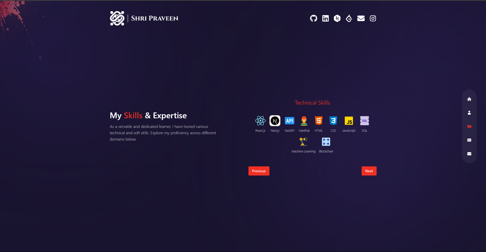
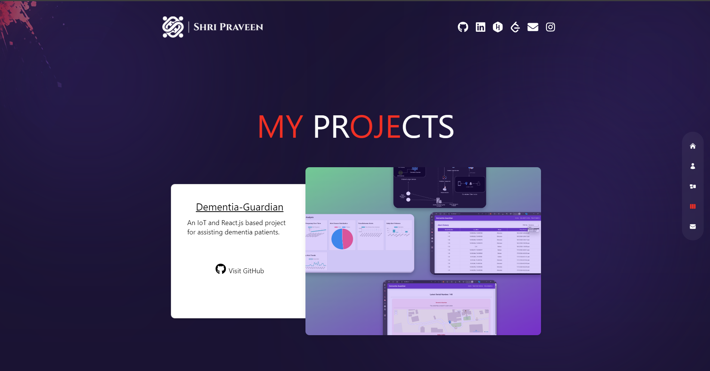
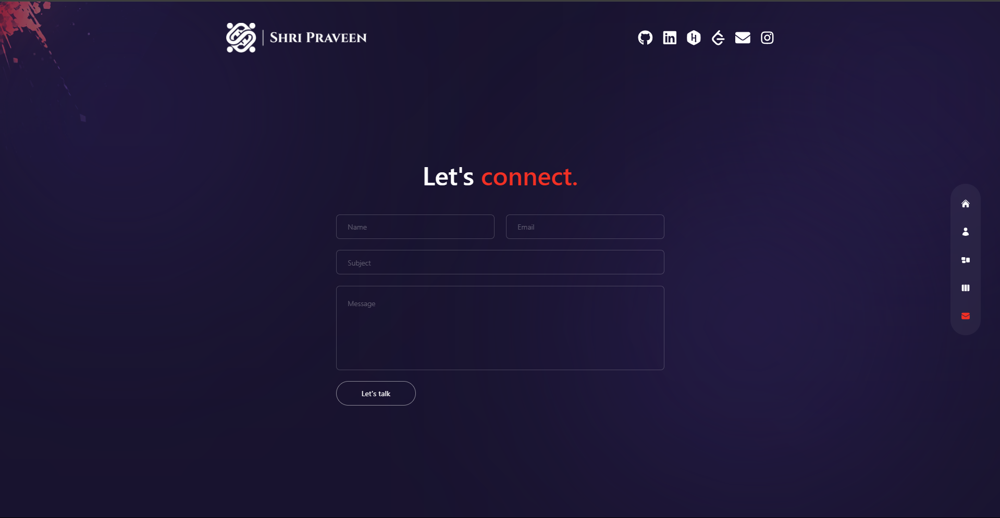

# Shri Praveen Portfolio

## Description

This project is a portfolio starter template for Ethan, showcasing various projects and information. The portfolio is designed to be modern and responsive, utilizing various technologies to create smooth transitions and engaging user experiences.

## Table of Contents

- [Description](#description)
- [Tech Stack](#tech-stack)
- [Dependencies](#dependencies)
- [Scripts](#scripts)
- [Files](#files)
- [Configuration](#configuration)
- [Screenshots](#screenshots)
- [Contributing](#contributing)
- [License](#license)

## Tech Stack

- **Frontend**: Next.js, Tailwind CSS, Framer Motion
- **Icons**: React Icons
- **HTTP Requests**: Axios
- **Backend**: Express, Nodemailer
- **Animations**: React Countup, React TSParticles, Swiper
- **Language**: TypeScript

## Dependencies

- `@fortawesome/fontawesome-svg-core`
- `@fortawesome/free-brands-svg-icons`
- `@fortawesome/free-solid-svg-icons`
- `@fortawesome/react-fontawesome`
- `@headlessui/react`
- `@next/font`
- `axios`
- `body-parser`
- `cors`
- `express`
- `framer-motion`
- `next`
- `nodemailer`
- `react`
- `react-confetti`
- `react-countup`
- `react-dom`
- `react-icons`
- `react-tsparticles`
- `react-use`
- `swiper`
- `tailwind-scrollbar`
- `tsparticles`
- `autoprefixer`
- `eslint`
- `eslint-config-next`
- `postcss`
- `tailwindcss`

## Scripts

- `dev`: Starts the development server.
  ```bash
  npm run dev
  ```
- `build`: Builds the application for production.
  ```bash
  npm run build
  ```
- `start`: Starts the production server.
  ```bash
  npm run start
  ```
- `lint`: Runs ESLint to analyze code for potential errors.
  ```bash
  npm run lint
  ```

## Files

- **`components`**: Contains various React components like `Transition`, `WorkSlider`, etc.
- **`pages`**: Includes different page components like `Home`, `About`, `Work`, etc.
- **`styles`**: Contains global CSS styles in `globals.css`.
- **`utils`**: Utility functions or constants.
- **`hooks`**: Custom React hooks.
- **`constants`**: Constants used in the project.
- **`services`**: Service-related files.
- **`types`**: TypeScript type definitions.

## Configuration

- **ESLint**: Configuration in `.eslintrc.json`.
- **PostCSS**: Configuration in `postcss.config.js`.
- **Tailwind CSS**: Configuration in `tailwind.config.js`.
- **Next.js**: Configuration in `next.config.js`.

## Screenshots

1. **Homepage**
   

2. **About Page**
   

3. **Work Page**
   

4. **Contact Page**
   

5. **Project Details**
   


## License

This project is licensed under the MIT License - see the [LICENSE](LICENSE) file for details.

---

